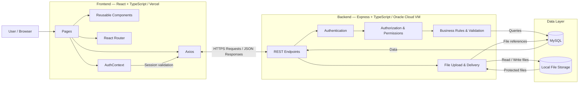

# Tasky — Architecture

## 1. Overview

Tasky uses a separated frontend and backend architecture.

The React + TypeScript frontend is hosted on Vercel and communicates with an Express REST API hosted on an Oracle Cloud VM. The backend is the only layer that communicates with MySQL and local uploaded files.

The architecture is intentionally simple and focused on the MVP.

## 2. High-Level Architecture



## 3. Project Structure

```text
Tasky/
│
├── README.md
├── docs/
│   ├── PRD.md
│   ├── TECH_STACK.md
│   ├── ARCHITECTURE.md
│   ├── ERD.md
│   ├── ERD.png
│   ├── API.md
│   └── PLAN.md
│
├── frontend/
├── backend/
└── ...
```

`PRD.md` defines the product requirements and MVP scope, `TECH_STACK.md` defines the technologies and tools used, `ARCHITECTURE.md` defines the system structure and how its main parts communicate, `ERD.md` defines the database entities and relationships, `ERD.png` provides a visual representation of the ERD, `API.md` defines the REST API endpoints and their behavior, and `PLAN.md` defines the implementation order and development tasks.

## 4. Frontend Architecture

```text
frontend/src/
├── components/
├── pages/
├── context/
├── App.tsx
└── index.tsx
```

- `pages/` contains complete screens and normally handles Axios requests.
- `components/` contains reusable UI components and remains flat for the MVP.
- `context/` contains `AuthContext`.
- Files containing JSX use `.tsx`; TypeScript files without JSX use `.ts`.
- Projects, Tasks, Users, and Notifications use local page state with `useState` and `useEffect`.
- `AuthContext` is the only global Context required for the MVP.
- No separate API service layer is used.

Protected pages share `Layout.tsx`, while Login and Registration remain public routes. `ProtectedRoute.tsx` controls access to protected pages.

## 5. Frontend Data Flow

```text
Page
  ↓
Axios
  ↓
Express REST API
  ↓
JSON Response
  ↓
Page State
  ↓
Reusable Components
```

After successful create, update, or delete operations, the page normally fetches the latest data again.

Each page handles its own loading and error states. Authentication failures invalidate the local session and return the user to Login.

## 6. Backend Architecture

```text
backend/
├── server.ts
├── tsconfig.json
├── uploads/
│   ├── attachments/
│   └── profile-images/
├── package.json
└── package-lock.json
```

The backend remains in one `server.ts` file for the MVP.

The file is organized internally into configuration, database connection, middleware, authentication helpers, authorization helpers, route groups, file handling, error handling, and server startup.

No separate routes, controllers, models, or services directories are used.

## 7. Database Access

The backend uses `mysql2`, a MySQL connection pool, and callback-based `db.query()` calls.

SQL is written directly inside `server.ts`. No ORM or MySQL Transactions are used in the MVP.

The frontend never connects directly to MySQL.

## 8. Authentication & Authorization

Tasky uses server-side session tokens stored in MySQL.

The token is stored in `localStorage`. When the app starts, `AuthContext` validates the token through an endpoint such as `/auth/me` before protected content is shown.

The frontend may hide or show controls based on user role, but the backend is always the final authority for authentication, authorization, and object permissions.

Authorization helper functions inside `server.ts` reduce repeated permission logic.

## 9. Workspace Isolation & Validation

The backend never trusts a `workspaceId` supplied by the frontend. The current Workspace is derived from the authenticated user.

All protected queries and object lookups must respect Workspace, Project, and role permissions.

Frontend validation improves usability, while the backend revalidates input and enforces all business rules and data integrity requirements.

## 10. File Architecture

Profile images and Task attachments are stored locally on the backend VM.

MySQL stores file references rather than file contents.

Uploaded files are not exposed as public static files. They are delivered through protected backend endpoints after session and permission checks.

## 11. Notifications

Notifications use Axios polling instead of WebSockets.

`Navbar.tsx` periodically requests the unread notification count. `NotificationsPage.tsx` loads the full notification list when opened.

## 12. Configuration & CORS

Environment-specific values are provided through environment variables, including database settings, backend port, frontend origin, and the frontend API URL.

CORS is restricted to the configured `FRONTEND_URL`.

API routes do not use an `/api` prefix because the Express backend exists only to serve the application API.

## 13. Deployment Architecture

```text
Browser
   │
   ▼
React Frontend
Vercel
   │
   │ HTTPS / Axios
   ▼
Express Backend
Oracle Cloud VM
   │
   ├── MySQL
   └── Local Upload Storage
```

Only the backend can access MySQL and local uploaded files.